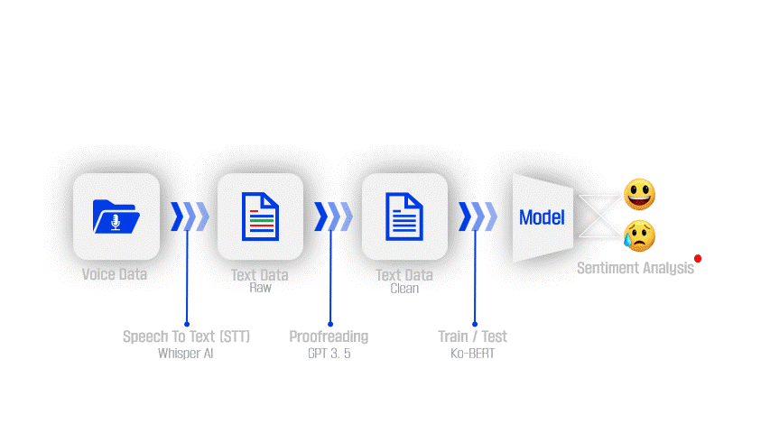
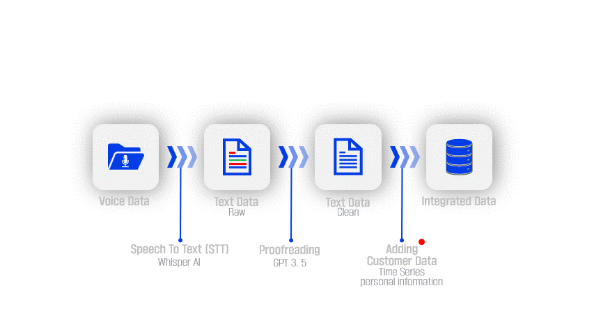

# :sparkles: Capstone Design : Data Analysis Projects :sparkles:
   
 

## :information_source: Information :information_source:
+ 고객 음성 데이터를 활용하여 고객의 서비스 만족을 정량적으로 평가할 수 있는 기술을 제시함.
+ 고객의 만족도를 주관적인 척도(5점 척도 기반의 설문지 등)를 활용하여 평가할 때 발생할 수 있는 모호함을 최소할 수 있을 것으로 기대됨.
+ 더불어 음성 데이터를 이용하여 통합된 데이터 생성하고, 기존 데이터와의 결합을 통하여 효율적인 고객 관리가 가능함.

## Main Project
### Voice-based Customer Satisfaction Assessment System :speech_balloon:
#### Pipeline of Training Process & Test Process :robot:

## Sub Project
### Building an Integrated Customer Voice Dataset :file_folder:
+ 중요 키워드와 시계열, 고객 개인정보를 포함하는 통합된 데이터
+ 탐색적 데이터 분석에 용이

## :memo: Note :memo:
+ **데이터 및 변수명, 프롬프트 등은 보안서약의 위반소지가 있으므로 업로드하지 않음.**
